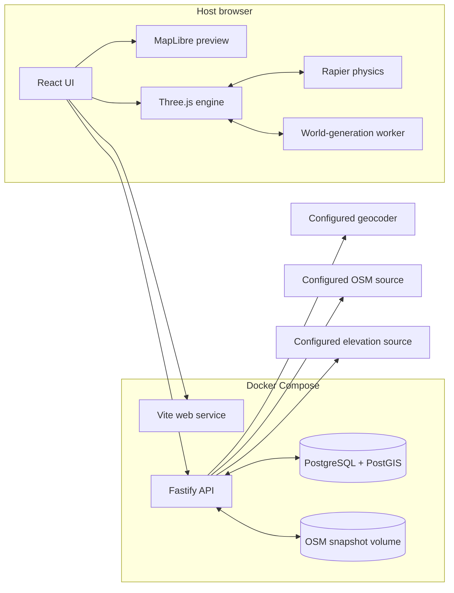

# Technical architecture

Status: Active

Last updated: 2026-08-31

## Architecture summary

OpenStreetMapTo3D is a TypeScript modular monolith delivered through Docker
Compose. The browser performs real-time rendering and vehicle physics while a
module Web Worker performs deterministic geometry planning and chunk
assignment. The server owns external data access, normalization, caching,
project persistence, and long-running import state. PostgreSQL with PostGIS
owns geospatial records and validation.



Docker does not render the 3D scene. The host browser uses the user's GPU;
containers provide the application, API, database, and cached data.

## Runtime responsibilities

### Web application

- Location and area-selection workflow
- Project editor and diagnostics
- Three.js scene lifecycle
- Fixed-timestep Rapier simulation
- Versioned Worker requests, progress, cancellation, and diagnostics
- Deterministic mesh planning and 256 m authoritative-owner chunks
- Affected-chunk-only scene and collider replacement after edits
- Input, cameras, and Drive mode
- Client-side validation and progress presentation

### API application

- Geocoding proxy and cache
- OSM source adapter and request limits
- Elevation-provider adapter, batching, coverage fallback, and attribution
- Import jobs and server-sent progress events
- OSM-to-GeoJSON normalization
- PostGIS geometry validation and clipping
- World/project persistence
- Source-snapshot and attribution records
- Immutable DEM grids and elevation content hashes
- Health, readiness, and structured diagnostics

### PostgreSQL and PostGIS

- Project metadata and settings
- WGS84 source geometry
- Elevation snapshot JSON and vertical-datum metadata
- Spatial indexes and boundary queries
- Validated and normalized feature records
- User overrides and build records

### Snapshot cache

- Compressed raw source responses
- Content-addressed paths using SHA-256
- Optional generated-artifact cache
- No secrets or executable content

## Planned repository boundaries

```text
apps/web                 Browser UI and runtime composition
apps/api                 HTTP API, adapters, imports, persistence
packages/contracts       Shared Zod DTOs and versioned messages
packages/geo             WGS84, ECEF, and local ENU conversions
packages/osm             OSM tags, classification, and defaults
packages/worldgen        Deterministic geometry generation
packages/simulation      Rapier vehicle and fixed-step loop
tests/e2e                Browser workflow coverage
database/init            Idempotent PostGIS schema
documents                Product and engineering documentation
```

Packages must not import from applications. Application-specific UI and HTTP
details must not leak into `geo`, `osm`, `worldgen`, or `simulation`.

## Principal request flow

```text
User submits search
  -> API geocoder adapter
  -> cached result returned
  -> user selects bounding box
  -> API fetches OSM and elevation concurrently
  -> API creates one immutable source snapshot
  -> normalization and PostGIS validation
  -> normalized WorldDefinition returned
    -> browser Worker creates a serializable deterministic WorldPlan
  -> Three.js creates visible meshes from the WorldPlan
  -> Rapier creates matching heightfield and road colliders from the WorldPlan
```

## Architectural invariants

1. Source geometry remains WGS84 in persistence.
2. Rendering and physics use meters in a local ENU frame.
3. A source snapshot is immutable after successful retrieval.
4. User changes are stored as overrides, not mutations to the snapshot.
5. World generation is deterministic and versioned.
6. Public OSM services are accessed only through server adapters.
7. CI and automated tests never depend on public map services.
8. Per-frame engine state does not flow through React component state.
9. Physics colliders are allowed to be simpler than visible geometry.
10. Every displayed or exported world retains source attribution.
11. A feature has one deterministic owner chunk; junction dependencies map the
    source feature to every chunk that must be rebuilt after an edit.
12. Worker messages and override payloads are explicitly versioned.
13. An elevation grid is immutable and its content hash contributes to build
    identity.
14. Terrain rendering and collision consume the same x-major chunk heights.

## Deliberate simplifications

- One API process rather than microservices
- No Redis; job state starts in PostgreSQL
- No WebSockets; progress uses server-sent events
- GPU buffer upload and Rapier object creation remain on the main thread
- Worker output uses structured-cloneable arrays rather than a persistent mesh
  cache or streaming binary format
- Tunnel overhangs use a diagnosed open-cut representation while terrain is a
  heightfield
- Generated meshes are caches, not primary records

## Evolution points

Interfaces should permit, without rewriting the editor:

- Moving imports into a separate worker container
- Replacing public Overpass with local `.osm.pbf` extracts
- Replacing Nominatim with a managed or self-hosted geocoder
- Adding global or self-hosted DEM providers behind the elevation contract
- Adding imagery with a compatible license
- Streaming large worlds by chunk
- Exporting generated geometry and attribution manifests

See the architecture decision records in [decisions](decisions/) for the
rationale behind the core choices.
